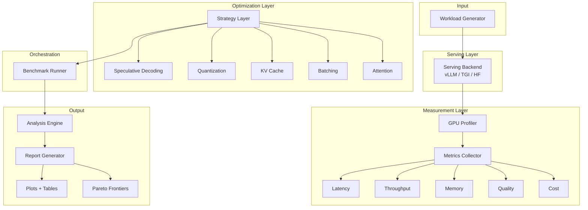

# llm-inference-benchmark

**Stress-testing LLM inference: speculative decoding, KV cache optimization, quantization, batching, and attention strategies — measured on real hardware with real workloads**

A comprehensive benchmarking suite that stress-tests LLM serving and inference optimization strategies across model sizes, hardware, and providers. This is NOT a tutorial or wrapper — it is an original benchmarking tool that produces actionable performance data.

## Architecture



## Strategies Benchmarked

### 1. Speculative Decoding
Draft model generates candidate tokens, target model verifies them in parallel. This strategy trades extra compute (running two models) for lower latency by accepting multiple tokens per forward pass when the draft model's predictions align with what the target model would have generated. Best suited for scenarios where latency matters more than throughput, and when a good draft model exists for the target model family.

### 2. KV Cache Optimization
Paged attention (vLLM-style), sliding window attention, and token eviction policies (H2O-style heavy hitter retention). These strategies trade memory management overhead for dramatically lower memory footprint, enabling longer sequences and larger batch sizes. Critical for production serving where memory is the primary bottleneck.

### 3. Quantization
GPTQ, AWQ, bitsandbytes 4/8-bit, and GGUF formats. Trades numerical precision for memory savings and throughput gains. The key question this benchmark answers: at what point does quality degrade unacceptably? We measure perplexity and task accuracy before and after quantization to quantify the quality-efficiency tradeoff.

### 4. Batching
Static batching (fixed size, padded), dynamic batching (group similar lengths), and continuous batching (vLLM-style iteration-level scheduling). Trades per-request latency for aggregate throughput. The optimal strategy depends on your workload characteristics and SLA requirements.

### 5. Attention Optimizations
FlashAttention-2, Grouped Query Attention (GQA), and Multi-Query Attention (MQA). Trades implementation complexity for significant memory and compute savings. FlashAttention-2 provides memory-efficient exact attention, while GQA/MQA reduce KV cache size through key-value head sharing.

### 6. Parallelism
Tensor parallelism and pipeline parallelism for multi-GPU scaling. Trades communication overhead (GPU-to-GPU bandwidth) for the ability to serve larger models or achieve higher throughput. We measure scaling efficiency to identify when adding more GPUs provides diminishing returns.

## Metrics

### Latency Metrics
- **Time to First Token (TTFT)**: Time from request submission to first generated token. Critical for interactive applications.
- **Per-Token Latency**: Inter-token interval during generation. Affects perceived streaming smoothness.
- **End-to-End Latency**: Total request completion time. Important for batch processing.
- **Percentiles**: P50, P95, P99 to understand latency distribution and tail behavior.

### Throughput Metrics
- **Generation Tokens/sec**: Output token generation speed.
- **Prefill Tokens/sec**: Input processing (prompt encoding) speed.
- **Requests/sec**: System capacity at various batch sizes.
- **Throughput Scaling Efficiency**: How well throughput scales with batch size.

### Memory Metrics
- **Peak GPU Memory**: Maximum memory usage during inference.
- **KV Cache Memory**: Memory consumed by key-value caches.
- **Memory Efficiency Ratio**: Useful compute memory vs. total allocated.
- **Memory vs. Sequence Length**: How memory scales with context size.

### Quality Metrics
- **Perplexity**: Measured on WikiText-2 and C4 subsets before/after optimization.
- **Task Accuracy**: MMLU and HellaSwag subsets to measure reasoning degradation.
- **Quality Degradation Score**: Normalized metric showing quality loss per speedup gained.

### Cost Metrics
- **$/1M Tokens**: Estimated cost based on GPU rental rates and throughput.
- **Tokens per GPU-Hour**: Raw efficiency metric for cost planning.
- **Pareto Efficiency**: Identifies non-dominated strategies on quality-cost-latency frontier.

## Workloads

### Short Prompts
100 prompts of 1-3 sentences each, targeting 50-100 output tokens. Mix of QA, instructions, and chat-style queries. Simulates typical chatbot interactions.

### Long Context
50 prompts with 4K-16K context windows (documents + questions). Targets 200-500 output tokens. Simulates document QA, summarization, and RAG workloads.

### Batch Processing
Same prompts tested at batch sizes [1, 4, 8, 16, 32, 64]. Measures throughput scaling and optimal batch size for offline processing.

### Multi-Turn Conversation
30 conversations with 5 turns each, growing context. Measures KV cache pressure over time and long-conversation performance degradation.

## Supported Models

| Model | Family | Parameters | Context Length |
|-------|--------|------------|----------------|
| Llama-2-7B | Llama | 7B | 4096 |
| Llama-2-13B | Llama | 13B | 4096 |
| Mistral-7B | Mistral | 7B | 8192 |
| Pythia-70M | Pythia | 70M | 2048 |
| Pythia-160M | Pythia | 160M | 2048 |
| Pythia-410M | Pythia | 410M | 2048 |
| Pythia-1B | Pythia | 1B | 2048 |
| Phi-2 | Phi | 2.7B | 2048 |

## Quick Start

```bash
# Install the package
pip install -e ".[all]"

# Run a basic benchmark (Mistral-7B, short prompts, vLLM backend)
python scripts/run_benchmark.py \
    --models mistral-7b \
    --workloads short \
    --backends vllm \
    --output results/

# Generate report from results
python scripts/generate_report.py --input results/ --output reports/
```

## CLI Usage

```bash
# Full benchmark suite
python scripts/run_benchmark.py \
    --strategies all \
    --models all \
    --workloads all \
    --backends all \
    --output results/

# Selective benchmark
python scripts/run_benchmark.py \
    --strategies speculative,quantization \
    --models llama-7b,mistral-7b \
    --workloads short,long \
    --backends vllm,hf \
    --output results/

# Single strategy benchmark
python scripts/run_single_strategy.py \
    --strategy quantization \
    --quantization-method gptq \
    --model mistral-7b \
    --output results/

# Head-to-head comparison
python scripts/compare_strategies.py \
    --strategy-a baseline \
    --strategy-b speculative \
    --model llama-7b \
    --output results/comparison/
```

## Results

### Strategy Comparison Matrix (Placeholder)

| Strategy | TTFT (ms) | Tokens/sec | Peak Memory (GB) | Perplexity | $/1M Tokens |
|----------|-----------|------------|------------------|------------|-------------|
| Baseline (FP16) | - | - | - | - | - |
| Speculative Decoding | - | - | - | - | - |
| GPTQ 4-bit | - | - | - | - | - |
| AWQ 4-bit | - | - | - | - | - |
| INT8 (bitsandbytes) | - | - | - | - | - |
| Continuous Batching | - | - | - | - | - |
| FlashAttention-2 | - | - | - | - | - |

### Throughput Scaling (Placeholder)

| Batch Size | Baseline | Continuous Batching | FlashAttention-2 |
|------------|----------|---------------------|------------------|
| 1 | - | - | - |
| 4 | - | - | - |
| 8 | - | - | - |
| 16 | - | - | - |
| 32 | - | - | - |

### Quality vs. Speedup Tradeoff (Placeholder)

| Method | Speedup | Perplexity Delta | MMLU Delta |
|--------|---------|------------------|------------|
| GPTQ 4-bit | - | - | - |
| AWQ 4-bit | - | - | - |
| INT8 | - | - | - |
| INT4 (NF4) | - | - | - |

## Tech Stack

- **Deep Learning**: PyTorch, HuggingFace Transformers
- **Serving**: vLLM, HuggingFace TGI
- **Quantization**: bitsandbytes, auto-gptq, autoawq
- **Optimization**: Flash Attention, accelerate
- **Profiling**: pynvml, torch.cuda
- **Visualization**: matplotlib, plotly, seaborn
- **Data**: pandas, numpy, datasets

## Installation

```bash
# Basic installation
pip install -e .

# With development tools
pip install -e ".[dev]"

# With TGI support
pip install -e ".[tgi]"

# With notebook support
pip install -e ".[notebooks]"

# Full installation
pip install -e ".[all]"
```

## Configuration

Benchmark behavior is controlled by YAML files in `configs/`:

- `benchmark_config.yaml`: Global settings (warmup runs, measurement runs, output directory)
- `models.yaml`: Model registry with HuggingFace paths and default configs
- `hardware_profiles.yaml`: GPU specifications for result normalization

## Contributing

Contributions are welcome! Please read our contributing guidelines and submit pull requests.

## License

MIT License - see [LICENSE](LICENSE) for details.
